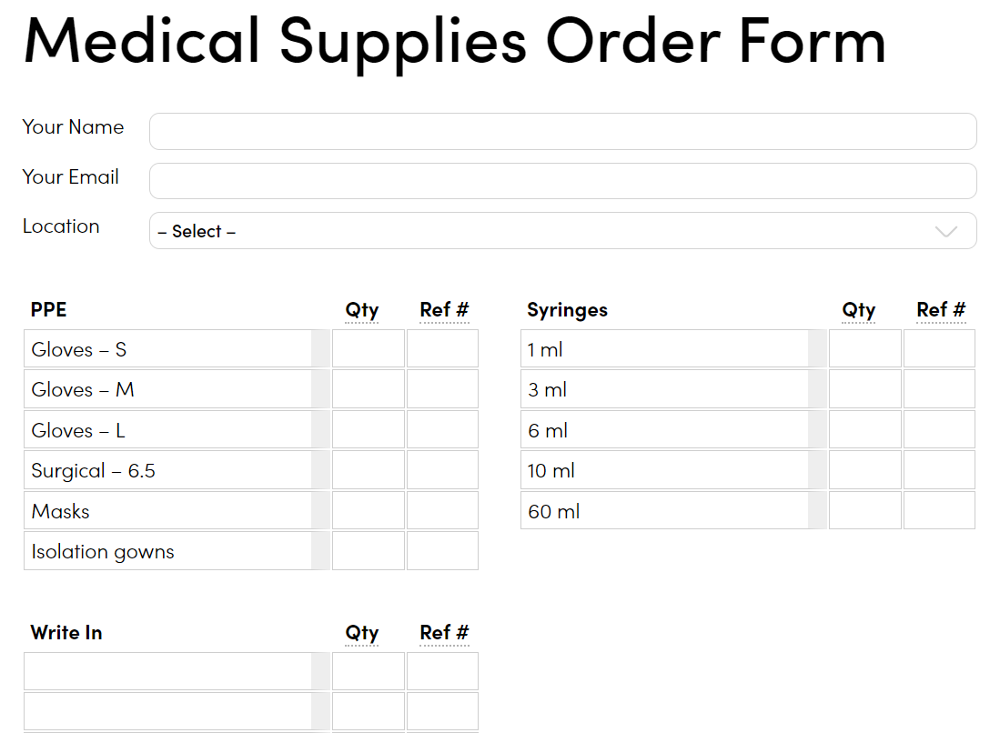
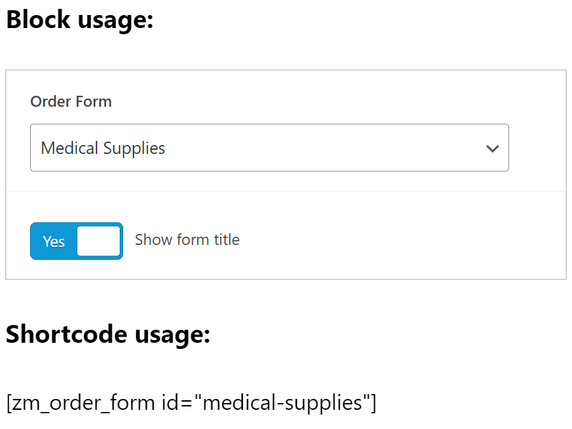

ZingMap Order Forms
---

    Author: Radley Sustaire
    Author URI: https://radleysustaire.com/
    Plugin URI: https://zingmap.com/
    Contributors: radgh
    Donate link: https://paypal.me/radgh
    Requires at least: 6.4.1
    Tested up to: 6.4.1

This custom WordPress plugin allows you to create order forms to request products to be restocked.

The order forms can be filled out and emailed to multiple recipients. The order form can only be filled out by users with the included "Office Manager" role, or users with "edit_pages" permissions.

## Installation and Usage ##

*Advanced Custom Fields Pro is required: https://www.advancedcustomfields.com/*

### 1. Download the plugin: [zm-order-forms.zip](https://github.com/RadGH/zm-order-forms/archive/refs/heads/master.zip)

### 2. Upload through the Plugins screen.

### 3. Create forms in Settings > Order Forms.

### 4. Display forms with the "Order Form" block, or the shortcode [zm_order_form id="FORM_ID_HERE"]

## Screenshots ##

### Example of the form:

### Example of the block and shortcode usage:

## Changelog ##

#### 1.2.0
* Added to GitHub

#### 1.1.2
* First release